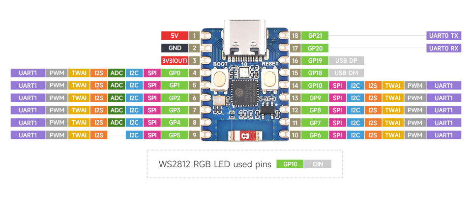

# Workshop Instructions

## Download this repository
We will be using code examples from this repository, so start by downloading it from [https://github.com/tgifford-usc/WindSensorWorkshop.git](https://github.com/tgifford-usc/WindSensorWorkshop.git)

If you are a git user, you can clone the repository. If not, then just click on the Code button, and select "Download Zip"

## Arduino IDE
If you haven't already done so, download the Arduino IDE from [https://www.arduino.cc/en/software/#ide](https://www.arduino.cc/en/software/#ide)

## ESP32 board
We are using an ESP32-C3 board.  We need to add the ESP32 family of boards to the Arduino IDE.  Go to Arduino preferences, and in the settings Tab, find the field for adding "Additional boards manager URLs", and add the following: [https://raw.githubusercontent.com/espressif/arduino-esp32/gh-pages/package_esp32_index.json
](https://raw.githubusercontent.com/espressif/arduino-esp32/gh-pages/package_esp32_index.json
)

Then in the menu bar find Tools | Board | Boards Manager and search for esp32.  Find "esp32 by Espressif Systems" and click on Install.

## Connect to the ESP32
Plug the ESP32 into your computer using a USB cable. Now go to Tools | Board and select esp32 | ESP32C3 Dev Module.

Then go to Tools | Port and look for a likely candidate. Depending on what type of computer you are using, it might look something like COM1, or it might be something like /dev/cu.usbmodem3201.  One way to tell is to unplug the board and see what dissappears from the list. Then plug it back in and select that.

## Exercise 1: Blink
The ESP32-C3 has an RGB light that we can control.  Just to get started, lets make it blink.

This RGB light is of a type called a neopixel, made by a company called Adafruit. To use it, we need to install a library called Adafruit_neopixel

Go to Tools | Manage Libraries, and search for "Adafruit Neopixel". There may be a bunch with a similar name, but you want the one called exactly that. Click on Install.

Now go to File | Open and open WindWorkshop1_Blink.ino

Click on the "tick" button in the top left corner of the window. This will check that the code makes sense. If there are no problems, click on the left arrow button, which will send the code to the ESP32.

If it uploads correctly, it should start flashing blue.

It should also print out a message. To see this message, we need to use Tools | Serial Monitor. This should open a console where message can appear. Make sure you select 115200 baud if it isn't already.

You might need to also ensure that Tools | USB CDC on Boot is enabled. If not, enable it, and unplug/replug your ESP32.

## Exercise 2: Analog Input
Next we will wire up an analog wind sensor. Refer to this pinout diagram

Connect one output of the wind sensor to ground, and the other to GP1. For the moment be careful not to spin the wind sensor very fast.

Upload the program WindWorkshop2_AnalogSensor, and check the serial monitor.  It should be printing out values between 0 and 4095. We want the numbers to be bigger when the wind sensor is spinning in the right direction. Very gently turn the sensor. If the numbers are going to wrong way, then switch the wires from the sensor around. Then add a Schottky diode in reverse bias to prevent negative voltages from reaching the input pin of the ESP32.

Now have a look at the signal using Tools | Serial Plotter.  Try spinning the sensor forwards and backwards (assuming you have added the backwards protection diode).

You may want to smooth the signal by adding a LowPass filter with a capacitor and resistor (1 microFarad and 100 kiloOhms are reasonable values).

## Exercise 3: WiFi Connection
The best thing about the ESP32 is that it has inbuilt WiFi. It can even act as a WiFi access point.

Open the file WindWorkshop3_OSC. Change the line in CONFIGURATION that call the SSID "ESP32-C3-AP".  Call it something else, otherwise it will be very confusing if everyone in the workshop is advertising a WiFi network with the same name.

Now upload this program to the ESP32. The light should be briefly red, then turn green if it has successfully setup a WiFi network. You should be able to join this network using your laptop, with whatever password you used in the program (default is 12345678). If you successfully connect to the network, the ESP32 light should turn blue.

Now open Touch Designer and open the file WindMonitor.toe
You should be able to see a graph of the values displayed in Touch Designer.

## Exercise 4: WindSound
Now we will add some local audio to the ESP32, using a DFPlayer Mini, and have it make a sound when the wind blows.  Referring to this diagram
 connect up the DFPlayer to the ESP32. You should connect the 3.3V output of the ESP32 to VCC on the DFPlayer, and then connect GP3 to DFPlayer TX and GP4 to DFPlayer RX. 

Add a speaker to the circuit connected to the DFPlayers SPK_1 and SPK_2. Then on the SD card you need an audio file in mp3 format.  There should be a folder called mp3 at the root of the SD card, and put your audio file in there called 0001.mp3.

Upload the program WindWorkshop4_Sound.ino.  When the wind sensor spins it should play the audio file.

## Exercise 5: Trigger from Laptop
Finally we will also trigger sounds on the DFPlayer from the laptop, also using an OSC message.

Load the program Workshop5_TriggerFromLaptop.ino to the ESP32. Make sure the laptop is connected to the ESP's network.  Open PlayViaOSC.toe in Touch Designer. Press the Play button, and the sound should play.

